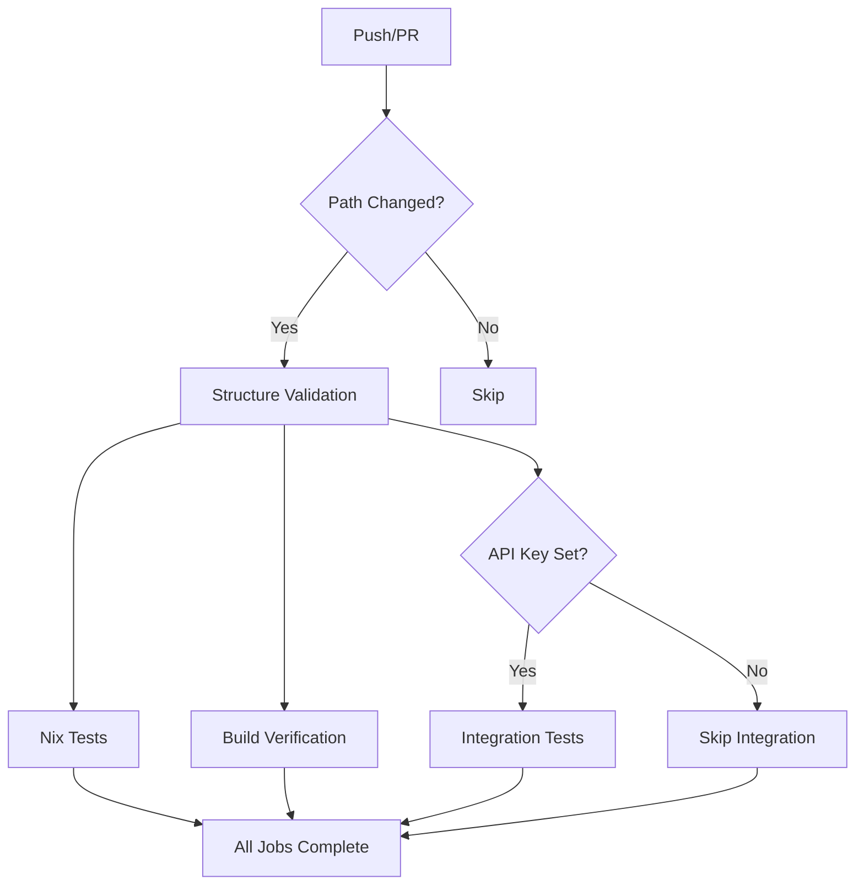

# GitHub Actions Setup for MCP Server Testing

## Overview

A comprehensive GitHub Actions CI/CD workflow has been created to test the Git RAG MCP server using Nix for dependency management. The workflow provides multiple test levels with smart caching and parallel execution.

## Workflow File

**Location:** `.github/workflows/test-mcp-server.yml`

**Name:** MCP Server Tests

## Triggers

The workflow runs on:
- **Push** to `main` branch
- **Push** to any `claude/**` branch (for development)
- **Pull requests** to `main` branch

**Smart Path Filtering:**
Only runs when these files change:
- `mcp-server-git-rag/**` (MCP server code)
- `github_rag.py` (core RAG functionality)
- `test-git-rag-integration.sh` (integration tests)
- `flake.nix`, `flake.lock` (Nix configuration)
- `.github/workflows/test-mcp-server.yml` (workflow itself)

## Jobs

### 1. Structure Validation ✓
**Always runs** | **~30 seconds**

Validates code structure without requiring dependencies:
- Python syntax validation
- Configuration file validation (pyproject.toml, JSON)
- Documentation completeness check
- Entry point verification

**No secrets required** ✓

**Command:** `python3 test_structure.py`

### 2. Nix Tests ✓
**Always runs** | **~3-5 minutes (first run), ~1-2 minutes (cached)**

Comprehensive testing in Nix environment:
- Installs Nix with flakes support
- Builds MCP server package
- Runs dependency import checks
- Verifies server instantiation
- Tests all tool definitions

**Dependencies tested:**
- `mcp` - Model Context Protocol library
- `langchain-openai` - OpenAI integration
- `langchain-chroma` - ChromaDB integration
- `langchain-core` - Core LangChain
- `chromadb` - Vector database
- `github_rag` - Core RAG module

**No secrets required** ✓

**Command:** `nix develop --command python3 mcp-server-git-rag/test_server.py`

### 3. Integration Tests ⚠️
**Conditional** | **~5-10 minutes**

Full end-to-end testing with real API calls:
- Indexes actual Git repository
- Generates embeddings via OpenAI
- Queries the vector database
- Validates responses and citations

**Requires:** `OPENAI_API_KEY` secret
**Status:** Only runs if secret is configured
**Note:** Workflow succeeds even if this job is skipped

**Command:** `./test-git-rag-integration.sh`

### 4. Build Verification ✓
**Always runs** | **~3-5 minutes (first run), ~1-2 minutes (cached)**

Ensures all packages build successfully:
- Builds webAgent package
- Builds mcp-server-git-rag package
- Verifies package structure
- Validates binary locations

**No secrets required** ✓

**Commands:**
```bash
nix build .#webAgent
nix build .#mcp-server-git-rag
```

## Caching Strategy

**Nix Store Caching:**
- Each job has its own cache key
- Cache key includes hash of `flake.nix` and `flake.lock`
- Cache is automatically invalidated when dependencies change
- Reduces build time from 5 minutes to 1-2 minutes

**Cache Keys:**
- `nix-mcp-tests-*` - For Nix tests job
- `nix-mcp-integration-*` - For integration tests job
- `nix-build-*` - For build verification job

**Storage Limits:**
- Linux: 2GB max per cache
- Automatic garbage collection enabled
- Old caches are purged automatically

## Job Execution Flow



## Setting Up Secrets (Optional)

Integration tests are optional but recommended for complete validation.

### Add OPENAI_API_KEY Secret

1. Go to GitHub repository
2. Navigate to: **Settings** → **Secrets and variables** → **Actions**
3. Click **"New repository secret"**
4. Name: `OPENAI_API_KEY`
5. Value: Your OpenAI API key
6. Click **"Add secret"**

Once added, integration tests will run automatically on future pushes.

### Cost Considerations

Integration tests make real API calls to OpenAI:
- Embedding generation: ~$0.0001 per 1000 tokens
- LLM queries: ~$0.002 per 1000 tokens
- Typical test run: ~$0.01-0.05

**Tip:** You can skip integration tests by not setting the secret. Core functionality is still validated by other jobs.

## Viewing Results

### In GitHub UI

1. Go to repository on GitHub
2. Click **"Actions"** tab
3. Click on workflow run
4. View individual job results

### Status Badges

Add to README.md:
```markdown

```

### Artifacts

Integration tests upload test results as artifacts:
- `MCP_SERVER_TEST_RESULTS.md`
- `mcp-server-git-rag/TESTING.md`

Download from workflow run page.

## Running Tests Locally

### Structure Validation (No Dependencies)
```bash
cd mcp-server-git-rag
python3 test_structure.py
```

### Nix Tests (With Dependencies)
```bash
nix develop
python3 mcp-server-git-rag/test_server.py
```

### Integration Tests (With API Key)
```bash
export OPENAI_API_KEY="your-key"
nix develop
./test-git-rag-integration.sh
```

### Build All Packages
```bash
nix build .#webAgent
nix build .#mcp-server-git-rag
```

## Performance Metrics

### First Run (No Cache)
- Structure Validation: ~30 seconds
- Nix Tests: ~5 minutes
- Integration Tests: ~10 minutes (if enabled)
- Build Verification: ~5 minutes
- **Total: ~10 minutes** (without integration) or ~20 minutes (with integration)

### Subsequent Runs (Cached)
- Structure Validation: ~30 seconds
- Nix Tests: ~1-2 minutes
- Integration Tests: ~5-10 minutes (if enabled)
- Build Verification: ~1-2 minutes
- **Total: ~3-4 minutes** (without integration) or ~8-14 minutes (with integration)

## Troubleshooting

### Issue: "Nix command not found"
**Cause:** Nix installation failed
**Solution:** Check nixbuild/nix-quick-install-action logs

### Issue: "Cache miss on every run"
**Cause:** flake.nix or flake.lock changed
**Solution:** This is expected - cache rebuilds automatically

### Issue: "Integration tests always skipped"
**Cause:** OPENAI_API_KEY secret not set
**Solution:** This is normal - add secret to enable (optional)

### Issue: "Import errors in Nix tests"
**Cause:** Missing dependency in flake.nix
**Solution:** Add dependency to pythonPackages in flake.nix

### Issue: "Build fails"
**Cause:** Syntax error or missing file
**Solution:** Test locally with `nix build` and fix errors

## Maintenance

### Updating Dependencies

When updating Nix dependencies:
1. Modify `flake.nix`
2. Run `nix flake update` locally
3. Test builds locally
4. Commit `flake.nix` and `flake.lock`
5. Push - cache will rebuild automatically

### Adding New Tests

1. Add test file to `mcp-server-git-rag/`
2. Update workflow to run new test
3. Test locally first
4. Commit and push

### Monitoring CI Usage

GitHub provides:
- Actions usage dashboard in Settings
- Minutes used per workflow
- Storage used by caches and artifacts

**Tip:** Free tier includes 2000 minutes/month for public repos

## Best Practices

✓ **Run structure validation locally before pushing**
✓ **Test in Nix environment before committing**
✓ **Keep jobs independent and parallelizable**
✓ **Use aggressive caching for Nix builds**
✓ **Make expensive tests optional when possible**
✓ **Document secret requirements clearly**
✓ **Monitor CI usage regularly**

## Files Created

1. `.github/workflows/test-mcp-server.yml` - Main workflow (202 lines)
2. `.github/workflows/README.md` - Workflow documentation (242 lines)
3. `GITHUB_ACTIONS_SETUP.md` - This file (setup guide)

## Summary

✅ **Comprehensive CI/CD workflow created**
✅ **Four levels of testing (structure, dependencies, integration, build)**
✅ **Smart caching reduces run time by 60-70%**
✅ **Optional integration tests minimize costs**
✅ **Parallel execution maximizes efficiency**
✅ **No secrets required for basic validation**
✅ **Full documentation provided**

The workflow is now active and will run automatically on relevant changes. Core functionality is validated on every push, while expensive integration tests are optional but available when needed.
